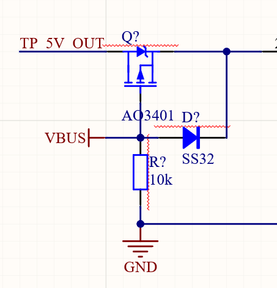
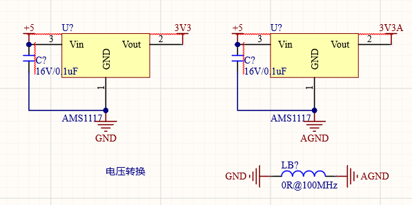

# RP2040开发板
# 简介
使用树莓派基金会推出的RP2040芯片进行拓展开发，集成一部分外设，设计开发板电路图以及PCB绘制。

包含GPIO引脚、I2C引脚、串口引脚引出；
## 外设
1. 陀螺仪
2. 音频输出
3. EEPROM
4. 红外接收发送
## 文件介绍
1. MasterControlChip.SchDoc

    RP2040最小系统电路，包含芯片，电源滤波，晶振，复位，外置FLASH，IO引出
    
    RUN引脚拉高，接按键接地，按下芯片复位  

2. PowerManager.SchDoc
    供电原理图，使用两节锂电池并联作为电源。
    
        1. TP5400进行锂电池充电并升压至5V

        2. 使用LDO转换3.3V对芯片进行供电，音频输出供电单独使用一个芯片，音频地与数字地使用磁珠隔离

# 外设
## GPIO外设
1. 引出所有40pin引脚

### LED
### 蜂鸣器
### 高低电平按键输入
## I2C外设
## SPI外设
## WIFI模块
