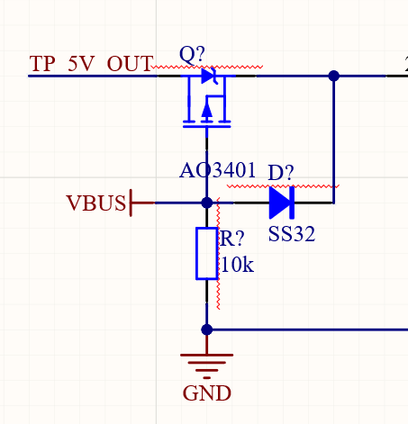

# 
RP2040开发板

# 简介
使用树莓派基金会推出的RP2040芯片进行拓展开发，集成一部分外设，设计开发板电路图以及PCB绘制。
## 文件介绍
### MasterControlChip.SchDoc

    RP2040最小系统电路，包含芯片，电源滤波，晶振，复位，外置FLASH，IO引出
    
    RUN引脚拉高，接按键接地，按下芯片复位  

### PowerManager.SchDoc
    供电原理图，使用两节锂电池并联作为电源。
    
    TP5400进行锂电池充电并升压至5V
    
# 外设
## GPIO外设
### LED
### 蜂鸣器
### 高低电平按键输入